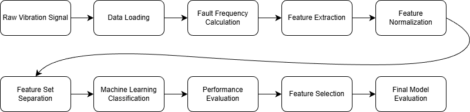

# Project 1-1: Bearing Fault Diagnosis  with HGU Dataset

**Date:** 2025-12-20  

**Student:** Joungbin Choi (22200757)  

**Class:** Industrial AI  

---

## 1. Introduction

Bearings are essential components in rotating machinery, and bearing failures are one of the major causes of overall system breakdowns. Failure to detect bearing faults at an early stage can lead to serious safety issues and significant economic losses.

In industrial environments, vibration-based bearing condition monitoring is the most widely used approach, and the demand for automated diagnostic systems that combine signal processing and machine learning techniques has continuously increased.

The objective of this project is to design an intelligent diagnostic algorithm that classifies normal and faulty bearing conditions (inner race, outer race, and ball faults) using the **HGU Bearing Dataset**.

To achieve this goal, the following approaches were applied:

- Extraction of statistical time/frequency-domain features, envelope features, and wavelet packet features  
- Performance comparison of SVM, kNN, and Decision Tree classifiers  
- Feature selection using Sequential Feature Selection (SFS)

---

## 2. Algorithm / Model Design

### 2.1 Flow Chart

### 2.2 Dataset Description

In this study, **HGU Bearing Dataset v1** was used.

The dataset is composed as follows:

- Sampling frequency: `fs = 8.3333`
- Rotational frequency: `fr = 12000`
- Classes:  
  - Normal (N1, N2)  
  - Inner Fault (I1, I2)  
  - Outer Fault (O1, O2)  
  - Ball Fault (B1, B2)  

Severity 1 and Severity 2 correspond to **aligned shaft** and **misaligned shaft** conditions, respectively.

### 2.3 Fault Characteristic Frequency

The characteristic fault frequencies were calculated using the bearing geometry parameters.

- $$
  BPFO (Outer\ race\ fault) = \frac {n_b} 2 \times fr \times \left(1- \frac {d} {D}\right) = 43.5954\ [Hz]  
  $$

- $$
  BPFI (Inner\ race\ fault) = \frac {n_b} 2 \times fr \times \left(1+ \frac {d} {D}\right) = 64.7379\ [Hz]  
  $$

- $$
  BSF (Ball\ fault) = \frac {D} {2d} \times fr \times \left(1- \left(\frac {d} {D}\right)^2\right) = 20.5367\ [Hz]  
  $$

- $$
  FTF (Cage\ fault) = \frac {fr} 2 \times \left(1- \frac d D \right) = 3.3535\ [Hz]  
  $$

These characteristic frequencies were utilized for envelope spectrum–based feature extraction.

### 2.4 Feature Extraction

A total of 46 features were extracted and grouped into three categories.

#### 1) Statistical Features (18 features)

- Statistical features are basic numerical descriptors in the time and frequency domains. They have very low computational cost and provide intuitive physical interpretation, making them widely used.
- Time-domain features (15): mean, standard deviation, RMS, average absolute value, energy, peak, peak-to-peak, impulse factor, shape factor, crest factor, marginal factor, skewness, kurtosis, square root average
- Frequency-domain features (3):
  - Center frequency (fc)  
  - RMS frequency (rmsf)  
  - Frequency variance (rvf)

#### 2) Envelope Features (12 features)

- The envelope represents the outer contour of amplitude modulation in high-frequency vibration signals. When a fault exists, impacts occur and excite high-frequency structural resonance, making envelope features well suited for fault diagnosis.
- High-pass filtering followed by the Hilbert transform
- From the FFT spectrum of the envelope signal:
  - BPFO, BPFI, BSF, and FTF
  - Magnitudes of the 1st to 3rd harmonics of each fault frequency were extracted

#### 3) Wavelet Packet Features (16 features)

- Wavelet packet decomposition is a multi-resolution time–frequency analysis method that reveals which frequency bands concentrate energy due to faults. It provides broader information than envelope analysis.
- Wavelet Packet Decomposition (Level 4, db4)
- Energy ratios of each frequency node were used as features

### 2.5 Feature Normalization

Z-score normalization was applied using the mean and standard deviation calculated from the training data. This improves classifier stability and overall performance.

### 2.6 Classification Models

The following three machine learning classifiers were employed.

- **Support Vector Machine (SVM)**  
  - A classifier that finds a hyperplane maximizing the margin between classes  
  - Gaussian Kernel: Used to map data into a higher-dimensional space for nonlinear classification  
    - $$
      K(x_i,x_j)=\exp\left(-\frac{\|x_i-x_j\|^2}{2\sigma^2}\right)  
      $$
  - Multi-class classification based on Error-Correcting Output Codes (ECOC)

- **k-Nearest Neighbor (kNN)**  
  - A distance-based classifier that assigns labels based on the k nearest training samples  
  - k = 5

- **Decision Tree**  
  - A rule-based classifier that recursively splits the feature space  
  - MinLeafSize = 5: Prevents excessive branching by keeping at least five samples per leaf

Each feature group (Statistical / Envelope / Wavelet / All Combined) was trained and evaluated under identical conditions.

### 2.7 Sequential Feature Selection (SFS)

- Sequential Feature Selection is a technique that incrementally selects a subset of features that maintains or improves classification performance, reducing overfitting and computational cost.
- 5-fold cross-validation, Forward Selection
- Evaluation function: kNN classification error
- Selected features were used to retrain SVM, kNN, and Decision Tree models

---

## 3. Results

### 3.1 Classification Accuracy

Classification accuracies for different feature sets and classifiers are shown below.

| Feature Set  | kNN    | SVM    | Decision Tree |
| ------------ | ------ | ------ | ------------- |
| Statistical  | 98.214 | 96.429 | 97.619        |
| Envelope     | 92.857 | 93.452 | 85.119        |
| Wavelet      | 98.214 | 97.619 | 91.071        |
| All Combined | 97.024 | 97.024 | 97.619        |

### 3.2 Confusion Matrix

- Statistical  

- Envelope  

- Wavelet  

- All Combined  

### 3.3 SFS Results

Sequential Feature Selection demonstrated that high classification performance could be achieved using only a small subset of key features.

Forward SFS selected six features (1, 2, 7, 10, 12, and 39), resulting in the following performance.

| Model               | Accuracy |
| ------------------- | -------- |
| kNN + SFS           | 98.81    |
| SVM + SFS           | 98.81    |
| Decision Tree + SFS | 94.643   |

After applying SFS, **SVM and kNN achieved the best performance**.

---

## 4. Analysis

### 4.1 Feature Effectiveness

- **Statistical Features**  
  - Mean values of eight features were plotted  
  - Data were divided into Severity 1 (aligned shaft) and Severity 2 (misaligned shaft)  
  - Some features show clear separability, while others show minimal differences (highlighted with red boxes), indicating the necessity of feature reduction via SFS

- **Envelope Features**

The first figure shows the power spectrum of raw vibration data under an inner fault condition. When plotted together with BPFI, the peaks do not align clearly. After applying Hilbert transform–based envelope analysis, the second figure shows clearer alignment between spectral peaks and BPFI, enabling more reliable fault-related feature extraction.

- **Wavelet Features**

The figure shows the wavelet packet energy distribution map for normal and ball fault conditions under Severity 2. The x-axis represents time, and the y-axis represents frequency nodes. With a level-4 decomposition, 16 nodes (0–15) are obtained. Brighter colors indicate higher energy concentration, and the ball fault condition exhibits significantly higher energy than the normal condition.

- **All Combined Features**

Statistical features are effective at distinguishing normal and faulty conditions due to impact-induced vibration changes. Envelope features are effective for identifying fault types using characteristic frequencies (BPFO, BPFI, BSF, FTF). Wavelet packet features capture energy distribution even for weak or time-varying fault patterns. Combining these complementary characteristics improves classification performance.

---

### 4.2 Error Analysis & Improvement

- Envelope features showed misclassification between Severity levels, such as confusion between N1 and N2 or O1 and O2, because envelope features primarily capture frequency location rather than severity-related amplitude changes.
- Confusion between normal and ball fault conditions was observed, as structural resonance or misalignment can generate frequency components similar to BSF harmonics even in normal states.
- Although the combined feature set is theoretically advantageous, redundant and noisy features can blur decision boundaries, resulting in performance degradation.
- Forward SFS selected the following features:

| Feature Index | Domain         | Definition              |
| ------------- | -------------- | ----------------------- |
| 1             | Statistical    | Mean                    |
| 2             | Statistical    | Standard Deviation      |
| 7             | Statistical    | Peak                    |
| 10            | Statistical    | Impulse / Shape related |
| 12            | Statistical    | Kurtosis                |
| 39            | Wavelet Packet | Specific node energy    |

High classification accuracy using only statistical features indicates that class-specific characteristics are clearly reflected in time-domain signals. Although wavelet features also showed high performance, only a single mid-to-low frequency node energy was sufficient, leading to the selection of feature 39.

---

## 5. Conclusion

In this study, vibration-based bearing fault diagnosis was investigated using **Statistical, Envelope, and Wavelet Packet** features combined with **SVM, kNN, and Decision Tree** classifiers.

Although combining all features provided stable performance, redundant features occasionally degraded classification accuracy. By applying **Forward Sequential Feature Selection (SFS)**, the number of features was reduced from 46 to six while achieving the highest accuracy of **98.81%** using kNN and SVM classifiers. This demonstrates that **feature selection is more critical than feature quantity**.

The proposed approach successfully designed an intelligent diagnostic algorithm capable of classifying normal and faulty bearing conditions (inner, outer, and ball faults) using the **HGU Bearing Dataset**.

---

## References

1. Jianhong Wang, Liyan Qiao, Yongqiang Ye and YangQuan Chen,  
   “Fractional Envelope Analysis for Rolling Element Bearing Weak Fault Feature Extraction,”  
   *IEEE/CAA Journal of Automatica Sinica*, vol. 4, no. 2, pp. 353–360, Apr. 2017.  
   doi: 10.1109/JAS.2016.7510166  

2. MathWorks. (n.d.). *Wavelet Packets: Decomposing the Details*.  
   In *Wavelet Toolbox™ User’s Guide*. Retrieved December 2025, from  
   https://kr.mathworks.com/help/wavelet/ug/wavelet-packets-decomposing-the-details.html  

3. T. W. Rauber, F. A. Boldt, and F. M. Varejão,  
   “Heterogeneous Feature Models and Feature Selection Applied to Bearing Fault Diagnosis,”  
   *IEEE Transactions on Industrial Electronics*, vol. 62, no. 1, pp. 637–646, Jan. 2015.

4. Y. K. Kim,  
   *Industrial AI: Feature Extraction and Machine Learning*,  
   Lecture notes, Industrial AI course, 2024.

