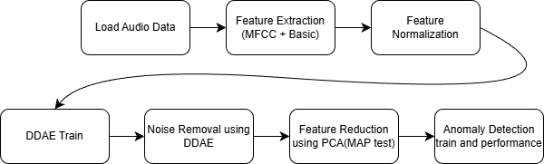
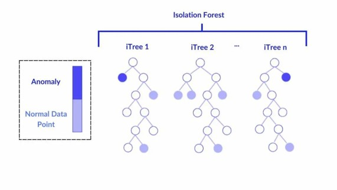

# Project 1-2. Sound-Based Anomaly Detection Using MIMII Dataset

**Date:** 2025-12-20  

**Student:** Joungbin Choi (22200757)  

**Class:** Industrial AI  


## 1. Introduction

### 1.1 Problem Statement

In modern industrial environments, early detection of machine anomalies is essential for preventing unexpected failures, ensuring safety, and reducing maintenance costs. Traditional fault diagnosis systems rely heavily on physical sensors such as vibration, temperature, or current sensors. Although effective, these approaches are expensive to install and maintain and often require intrusive access to machinery.

Sound-based anomaly detection has emerged as a promising alternative because acoustic signals naturally reflect internal machine conditions and can be collected non-invasively at low cost. However, real industrial environments are highly noisy, and background noise often masks the acoustic characteristics of abnormal machine behavior. This significantly degrades the performance of conventional sound-based anomaly detection methods.

To address this problem, this report presents an implementation and analysis of a previously proposed noise-robust anomaly detection model that utilizes a **Deep Denoising Autoencoder (DDAE)**.


### 1.2 Dataset

The **MIMII (Malfunctioning Industrial Machine Investigation and Inspection) dataset** used in this study was collected by a company, **Hitachi**, and consists of sounds recorded from industrial machinery operating in real-world environments. The dataset includes four types of industrial machines: **valves, pumps, fans, and slide rails**, and each machine type is composed of multiple product models, referred to as machine IDs. In addition to normal operating sounds, the dataset incorporates a variety of anomalous conditions that commonly occur in real industrial settings, such as **contamination, leakage, rotating unbalance, and rail damage**.


**Figure 1.** Recording Setup for Collecting Machine Sound Data

The audio data were recorded using an **eight-channel circular microphone array**, and the recording setup is illustrated in **Figure 1**. Each audio sample is provided as a single **10-second segment** and was recorded at a **sampling rate of 16 kHz**. To simulate realistic factory noise conditions, background noise collected from multiple real factories was mixed with the target machine sounds, resulting in audio data with three different signal-to-noise ratio (SNR) levels: **6 dB, 0 dB, and −6 dB**. These correspond to low-noise, moderate-noise, and high-noise industrial environments, respectively.


**Table 1.** MIMII Dataset Content Details

**Table 1** shows the number of audio segments available for normal and anomalous operating conditions.

---


## 2. Algorithm / Model Design

### 2.1 Flow Chart

The proposed anomaly detection framework:



**Figure 2.** Flow Chart

---


### 2.2 Feature Extraction

In this study, two complementary types of audio features are extracted from machine sound signals: **MFCC-based audio features** and **basic statistical audio features**. This dual-feature strategy enables the system to capture both spectral characteristics and temporal properties of machine sounds, which is essential for robust anomaly detection in noisy industrial environments.

#### 2.2.1 MFCC-Based Audio Features

Mel-Frequency Cepstral Coefficients (MFCC) are widely used in audio signal processing to represent the spectral structure of sound signals in a compact form. MFCC are designed to approximate human auditory perception by applying a Mel-scaled filter bank, which provides higher resolution in low-frequency regions and lower resolution in high-frequency regions.

**Procedure:**
1. Short-time framing (25 ms window, 10 ms hop)
2. Fast Fourier Transform (FFT)
3. Mel filter bank application
4. Logarithmic compression
5. Discrete Cosine Transform (DCT)
6. Temporal averaging

MFCC-based features primarily capture the overall spectral shape of the audio signal and are effective in distinguishing normal and abnormal operating conditions of industrial machines.


#### 2.2.2 Basic Audio Features

While MFCCs focus on frequency-domain information, **basic audio features** capture time-domain characteristics of the signal. These features are particularly useful for detecting impulsive sounds, irregular fluctuations, and abnormal amplitude patterns that often occur during machine faults.

| Feature            | Description            |
| ------------------ | ---------------------- |
| RMS                | Signal energy          |
| Kurtosis           | Tail heaviness         |
| Skewness           | Distribution asymmetry |
| Peak-to-Peak       | Amplitude range        |
| Crest Factor       | Peak-to-RMS ratio      |
| Mean               | Average amplitude      |
| Standard Deviation | Signal variability     |
| Entropy            | Signal randomness      |

These features provide intuitive physical interpretations of the signal behavior and can effectively characterize abnormal machine conditions. Moreover, their low computational complexity makes them suitable for real-time anomaly detection applications.


### 2.3 Feature Normalization

Since MFCC-based and basic features have different numerical ranges, Min–Max normalization is applied:

$$
x' = \frac{x - \min(x)}{\max(x) - \min(x)}
$$
Normalization is performed using statistics computed from **normal data recorded at SNR 6 dB**, ensuring consistency across all noise conditions.


### 2.4 Deep Denoising Autoencoder (DDAE)

#### 2.4.1 Model Concept

A Denoising Autoencoder learns to reconstruct clean data from noisy inputs. Given an original input \(x\), Gaussian noise is added:

$$
\tilde{x} = x + \mathcal{N}(0, (NF \cdot \sigma)^2)
$$
The model minimizes the reconstruction error:
$$
L = \|x - \hat{x}\|^2
$$


#### 2.4.2 Network Architecture


**Figure 3.** Proposed DDAE network architectures by type of features: (a) an undercomplete DDAE for MFCC-based audio features; (b) an overcomplete DDAE for basic audio features.


Undercomplete DDAE is used for MFCC-based features to enforce compact representations and suppress noise by learning only the most essential spectral characteristics. 

Overcomplete DDAE is employed for basic audio features to enhance representational capacity and preserve subtle temporal characteristics that may be lost in a compressed latent space.


#### 2.4.3 Training Details

- Loss function: Mean Squared Error (MSE)
- Optimizer: Adam
- Learning rate: 1e-4
- Epochs: 300
- Batch size: 64
- Noise Factors tested: 0.2, 0.5, 0.7


### 2.5 PCA with MAP Test

After denoising, PCA is applied to reduce feature dimensionality.  
The number of principal components is selected using the **Minimum Average Partial (MAP) test**, which identifies the point where residual correlations are minimized.
$$
MAP_m = \sum^p_{i=1} \sum^p_{j=1} \frac {{r^*_{ijm}}^2} {p(p-1)}
\\
i\ne j
$$


### 2.6 Anomaly Detection Models

Three unsupervised models are employed:

1. **Isolation Forest (IF)**  

   - Isolation Forest is an ensemble-based anomaly detection method that isolates data points by randomly selecting features and split values. Anomalies are expected to be isolated with fewer splits because they are rare and significantly different from normal data. This model does not rely on distance or density measures, making it well-suited for high-dimensional feature spaces and large datasets.

   

   **Figure 4.** Simple IF Logic Visualized Description

   

2. **One-Class SVM (OCSVM)**  

   - One-Class Support Vector Machine learns a decision boundary that encloses the majority of normal data samples in the feature space. During inference, samples lying outside this learned boundary are considered anomalous. By utilizing kernel functions, OCSVM can model complex, non-linear data distributions, making it effective for detecting subtle deviations from normal behavior.

   

   **Figure 5.** Simple OCSVM Logic Visualized Description

   

3. **Local Outlier Factor (LOF)**  

   - Local Outlier Factor detects anomalies by comparing the local density of a data point with the densities of its neighboring points. Samples that have significantly lower local density than their neighbors are regarded as anomalies. LOF is particularly effective in identifying local anomalies in datasets where normal data form clusters with varying densities.

   **Figure 6.** Simple LOF Logic Visualized Description

---


## 3. Results


### 3.1 Experimental Setup


**Table 2.** Sample Counts used for DDAE Training and Anomaly Detection Train and Test


The dataset was configured according to the sample sizes specified in **Table 2**, following the experimental protocol presented in the reference paper. For training the **Deep Denoising Autoencoder (DDAE)**, only the normal data recorded under the **6 dB SNR condition**, which corresponds to the least noisy environment, were used. This design choice ensures that the DDAE learns a clean and stable representation of normal machine sounds.

For training the anomaly detection (AD) models, only **normal data** were used, following an unsupervised learning paradigm. Normal data from all three SNR conditions (**6 dB, 0 dB, and −6 dB**) were included in the training set to improve robustness against varying noise levels.

The test dataset was constructed by evenly splitting the data into **50% normal samples and 50% abnormal samples**. This balanced test configuration enables a fair evaluation of anomaly detection performance.

The entire pipeline, from DDAE training to anomaly detection and testing, was conducted **independently for each machine ID**. The final performance was evaluated using the **Area Under the ROC Curve (AUC)**, and the reported results represent the **average AUC across four machine IDs**.


### 3.2 Feature Extraction


**Figure 7.** Statistical Feature Extraction Result


**Figure 8.** The MFCC Feature of Fan Data(Top two: raw normal and abnormal, Bottom two: denoised normal and abnormal)


**Figure 9.** The MFCC Feature of Pump Data(Top two: raw normal and abnormal, Bottom two: denoised normal and abnormal)


**Figure 10.** The MFCC Feature of Slide Data(Top two: raw normal and abnormal, Bottom two: denoised normal and abnormal)


### 3.3 Statistical Result

In the reference paper, particular emphasis was placed on the AUC values obtained under the **0 dB SNR condition**, as it represents the most realistic industrial noise environment. **Table 3** presents the anomaly detection performance for each machine type, indicating which model and noise factor (NF) achieved the highest AUC.

When comparing the experimental results with those reported in the reference paper, it was confirmed that the obtained AUC values exhibit similar trends and magnitudes. This consistency demonstrates that the implementation in this report successfully reproduces the performance characteristics of the original study.

| Machine    | Model | NF   | AUC       | Paper |
| ---------- | ----- | ---- | --------- | ----- |
| Fan        | LOF   | 0.7  | **0.966** | 0.965 |
| Pump       | LOF   | 0.7  | **0.953** | 0.953 |
| Slide Rail | LOF   | 0.7  | **0.941** | 0.948 |

**Table 3.** Result Table


**Figure 11.** Confusion Matrix

---


## 4. Analysis


### 4.1 Interpretation of Results

The experimental results confirm that the DDAE-based preprocessing framework effectively improves anomaly detection performance even in noisy industrial environments. In particular, the performance under the **0 dB SNR condition**, which is considered the most representative of real factory environments, shows a high level of consistency with the results reported in the reference paper.

As shown in **Table 3**, the optimal anomaly detection model and noise factor (NF) vary depending on the type of machine. The results indicate that applying noise factors of **0.7 and 0.5** leads to relatively high AUC values. This can be interpreted as evidence that sufficiently strong denoising effectively suppresses background noise while preserving discriminative characteristics of anomalous machine sounds.


### 4.2 Error Analysis

1. Pump and slider dataset

When the dataset was split according to the sample counts reported in the paper, an error occurred due to insufficient data availability. In the case of the pump machine, for IDs **id_02** and **id_06**, the number of abnormal samples available for testing was smaller than the desired number specified by the experimental protocol.

Although the original paper does not explicitly state that the test set was divided equally between normal and abnormal samples, we adopted a balanced test split (50% normal and 50% abnormal) to enable a more reliable and fair evaluation. As a result, **id_02** and **id_06**, which did not contain enough abnormal samples to satisfy this criterion, were excluded from the test evaluation.

```
id_00
  Train normal : 643  (available normal=1006)
  Test normal  : 138  (desired=138)
  Test abnormal: 137  (desired=137, available abnormal=143)

id_02
  Train normal : 624  (available normal=1005)
  Test normal  : 134  (desired=134)
  Test abnormal: 111  (desired=133, available abnormal=111)

id_04
  Train normal : 448  (available normal=702)
  Test normal  : 96  (desired=96)
  Test abnormal: 96  (desired=96, available abnormal=100)

id_06
  Train normal : 637  (available normal=1036)
  Test normal  : 136  (desired=136)
  Test abnormal: 102  (desired=136, available abnormal=102)
```

2. Overall AUC Differences

The experimental results were not identical across all runs. One source of discrepancy arises from the **feature extraction process**, particularly in MFCC extraction. Certain parameters, such as window size, hop length, and the number of filter coefficients, are not always specified with exact values in the reference paper. Variations in these implementation details can lead to differences in the extracted features and, consequently, in the resulting AUC values.

Despite these differences, the overall performance trends observed in this study closely match those reported in the reference paper. This suggests that while implementation-level details may affect absolute performance values, the proposed methodology exhibits consistent behavior and robustness.


### 4.3 Suggested Improvements

Although the proposed approach demonstrates strong performance, several limitations remain. First, the optimal noise factor varies not only across machine types but also across different machine IDs. Since the DDAE model is sensitive to the choice of noise factor, careful and potentially machine-specific tuning is required, which currently relies on empirical experimentation.

Additionally, the anomaly detection models used in this study do not explicitly consider **temporal dependencies** within audio signals. As a result, short-duration or transient anomalies may not be sufficiently captured.

---


## 5. Conclusion

In this report, a sound-based anomaly detection framework utilizing **Deep Denoising Autoencoder (DDAE)**-based preprocessing was implemented and analyzed to achieve robust anomaly detection under various noisy industrial environments. To this end, the **MIMII dataset**, which was collected to reflect real factory conditions, was used, and the system was reproduced based on the experimental settings and methodology proposed in the reference paper.

The experimental results demonstrate that the DDAE-based preprocessing effectively removes background noise and contributes to overall improvements in the performance of subsequent unsupervised anomaly detection models. In particular, the AUC performance under the **0 dB SNR condition**, which is regarded as the most representative of real industrial environments, showed a level of performance comparable to that reported in the reference paper. This confirms that the implementation in this report successfully reproduces the characteristics and performance trends of the original study.

Furthermore, it was observed that the optimal anomaly detection model and noise factor vary depending on the machine type and noise level. In relatively high-noise environments, stronger denoising achieved by applying larger noise factors proved to be more effective. This indicates that the DDAE plays a critical role in suppressing environment-specific noise components while preserving the essential characteristics of anomalous machine sounds.

---


## Reference

1. Kim, S.-M., & Kim, Y. S. (2024). *Enhancing Sound-Based Anomaly Detection Using Deep Denoising Autoencoder*. Department of Industrial and Systems Engineering, Kyonggi University Graduate School, Suwon, South Korea.
2. Spot Intelligence. (2024, May 21). *Isolation Forest*. Retrieved from https://spotintelligence.com/2024/05/21/isolation-forest/
3. Maithani, G. (n.d.). *One-Class SVM (OC-SVM)*. Medium. Retrieved from https://medium.com/@mail.garima7/one-class-svm-oc-svm-9ade87da6b10
4. godongyoung. (2019, March 11). *Local Outlier Factor (LOF)*. Retrieved from https://godongyoung.github.io/%EB%A8%B8%EC%8B%A0%EB%9F%AC%EB%8B%9D/2019/03/11/Local-Outlier-Factor%28LOF%29.html


